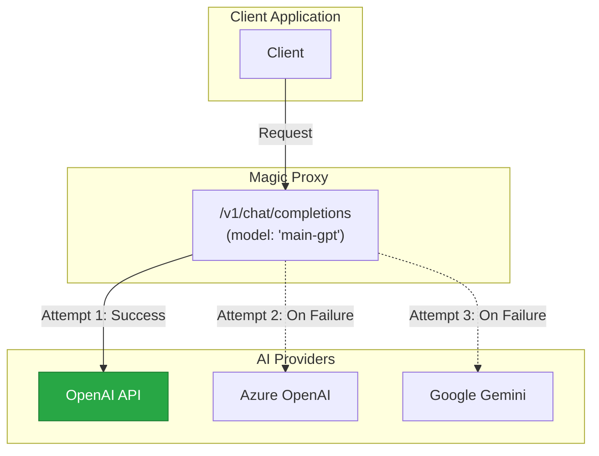
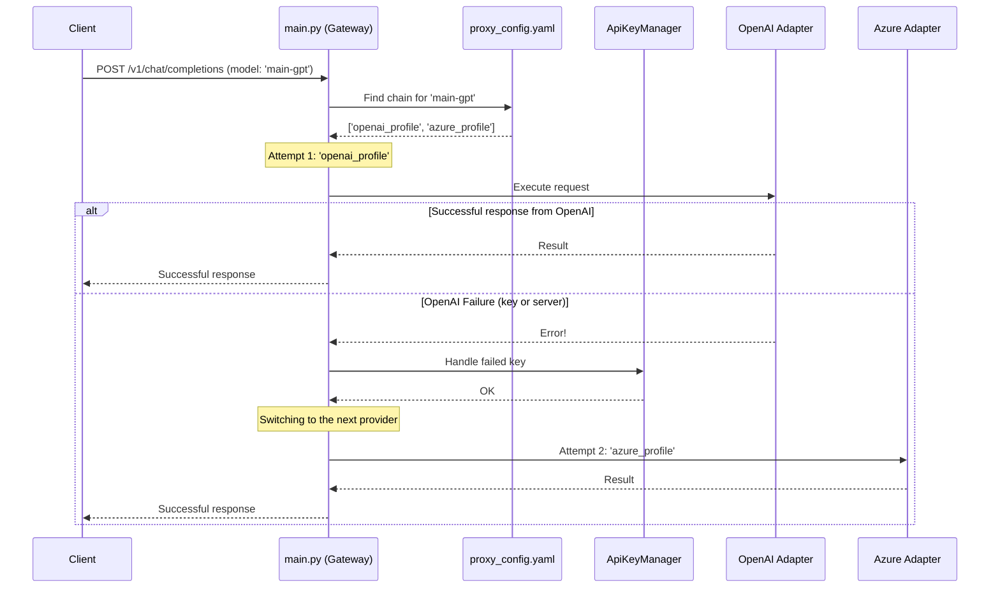
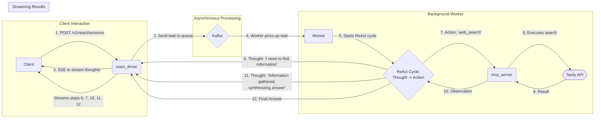

  
  <h1>Magic Proxy</h1>
  

    
    
    
  

> **Please Note:** This repository contains the official documentation for the Magic Proxy project. The source code is proprietary and not available here. This space serves as a comprehensive guide to its features, architecture, and capabilities for potential partners, investors, and customers.

**Magic Proxy** is not just an LLM proxy server, but an intelligent gateway designed for the **"cognitive enrichment"** of requests. It transforms standard model calls into deeply reasoned, structured sessions, allowing even basic models to solve complex tasks and advanced models to do so more reliably and predictably.

## Table of Contents
- [Key Features](#key-features)
- [Use Cases](#use-cases)
- [Competitive Advantage](#competitive-advantage)
- [Tech Stack](#tech-stack)
- [Architecture](#architecture)
- [How It Works (Visually)](#how-it-works-visually)
- [Documentation Navigation](#documentation-navigation)
- [Project Vision & Roadmap](#project-vision--roadmap)
- [Collaboration and Opportunities](#collaboration-and-opportunities)
- [Developer Sandbox: A Visual Tour of the Workflow](#developer-sandbox-a-visual-tour-of-the-workflow)

## Key Features

*   **Cognitive Enrichment Engine**: Implements advanced ReAct patterns, enabling models to iteratively "think," call external tools, and form responses based on observations.
*   **High-Availability Routing**: Automatically switches between different providers and API keys during failures, ensuring maximum fault tolerance.
*   **Universal Tool Server (MCP Server)**: A secure and isolated microservice for connecting any "hands"—external APIs, internal functions, or even other AI agents.
*   **Interactive UI Sandbox**: A web interface for testing, comparing models, observing the reasoning process, and managing the configuration on the fly.
*   **Declarative Configuration**: A single `proxy_config.yaml` file to manage all aspects of the gateway's operation—from routing to activating cognitive architectures.
*   **R&D Platform**: Easily create, test, and compare new cognitive patterns or tools simply by adding a file to the appropriate directory.

## Use Cases

Magic Proxy is a versatile platform that can be deployed in various scenarios today:

*   **High-Availability LLM Gateway**: For niche applications requiring a reliable gateway that functions similarly to `litellm`. It manages connections to multiple LLM providers, handles API key rotation, and monitors the health of each endpoint to ensure uninterrupted service.
*   **Intelligent Routing and Cost Management**: As a central router to direct requests to different models based on complexity, cost, or required capabilities, optimizing both performance and expenses.
*   **Foundation for Complex AI Agents**: Serves as a robust backend for developing sophisticated AI agents that require tool use, structured reasoning, and interaction with external APIs, all managed through a secure and scalable microservices architecture.

## Competitive Advantage

While there are tools that offer individual components of Magic Proxy's functionality, its key advantage lies in its integrated, all-in-one approach.

*   **The "All-in-One" Combiner**: Magic Proxy is the first of its kind to merge three critical functions into a single, cohesive system: a high-availability proxy, a cognitive enrichment engine (ReAct), and a universal tool server. Other solutions might offer one of these, but not a seamless combination.
*   **Focus on R&D and Extensibility**: The platform is built from the ground up as an R&D sandbox. The ability to define new, complex reasoning patterns simply by adding a Python file allows for rapid prototyping and customization of agent behavior, a feature not found in standard proxy tools.
*   **Production-Ready Architecture**: With a foundation in microservices, asynchronous processing via Kafka, and a full observability stack, Magic Proxy is designed for reliability and scalability, moving beyond simple scripts to a robust, enterprise-grade solution.

## Tech Stack

The project is built on a modern, reliable, and scalable technology stack:

*   **Core Framework**: Python, FastAPI, Uvicorn
*   **Containerization & Orchestration**: Docker, Docker-Compose
*   **Asynchronous Processing & Caching**: Apache Kafka, Redis
*   **Observability & Monitoring**: OpenTelemetry, Grafana, Loki, Promtail
*   **Key Libraries**: Pydantic (for data validation), HTTPX (as an asynchronous HTTP client)

## Architecture

The project consists of several key components working in tandem:

1.  **Main Gateway (`main.py`)**: The entry point based on FastAPI. It's responsible for receiving requests, routing, fault tolerance, and lifecycle management.
2.  **ReAct Engine (`react_driver.py`)**: The R&D core for cognitive enrichment. It orchestrates the iterative reasoning process, interacting with the LLM and the tool server.
3.  **Tool Server (`mcp_server.py`)**: A separate FastAPI service that provides standardized and secure access to external tools.
4.  **UI Sandbox (`frontend/`)**: A static web interface (HTML, JS, CSS) for interactive engagement with the gateway.

## How It Works (Visually)

### 1. High-Level Interaction: The Proxy as a "Black Box"

### 2. Internal Flow: Standard Request

### 3. Internal Flow: Request to the ReAct Engine

## Documentation Navigation

For a deeper understanding of each component, please refer to the detailed technical documentation:

*   **Core Components**:
    *   [**`main.py` - The Orchestrator**](./docs/description/eng/core/main.md)
    *   [**`proxy_config.yaml` - The Control Panel**](./docs/description/eng/core/proxy_config.md)
    *   [**`react_driver.py` - The R&D Core**](./docs/description/eng/core/react_driver.md)
    *   [**`key_manager.py` - High-Availability Manager**](./docs/description/eng/core/key_manager.md)
*   **[Frontend (UI Sandbox)](./docs/description/eng/frontend/User_Guide.md)**: A user guide for working with the interactive sandbox.
*   **Reasoning Patterns**:
    *   [**`basic_react` - The Standard Pattern**](./docs/description/eng/patterns/basic_react.md)
    *   [**`deepseek_react` - The Researcher Pattern**](./docs/description/eng/patterns/deepseek_react.md)
*   **[Available Tools](./docs/description/eng/tools/available_tools.md)**: A registry of all tools available to the agent.

## Project Vision & Roadmap

### Short-Term Goals (Next 3-6 Months): Becoming a Universal Orchestrator

*   **Integration with Generative Content Platforms**: Deep integration with ComfyUI, Godot, and Blender, transforming Magic Proxy into an intelligent adapter. The goal is to allow users to generate complex content (images, videos, 3D models, game scenes) through simple, abstract requests.
*   **Implementation of Hybrid (Nested) Scenarios**: A mechanism where one ReAct agent can call another as a tool. This will enable complex, multi-stage creative projects (e.g., generating concept art -> creating 3D models -> assembling a game scene).

### Mid-Term Goals (Next Year)

*   **Startup Formation**: Attracting funding to build a team, accelerate development, and bring the product to market.

### Long-Term Vision

*   **Democratizing Creativity and Development with AI**: I do not aim to replace existing specialized tools. My goal is to create a platform that bridges the gap between a human idea and its digital embodiment. I want to empower anyone—artists, developers, dreamers—to create everything they've ever dreamed of, using AI as a natural and powerful partner. Magic Proxy will become the "magic" tool that performs this magic, translating human imagination into the language of machines.

## Collaboration and Opportunities

I am actively seeking partners, investors, and collaborators who share my vision. If you are interested in leveraging Magic Proxy, investing in its future, or exploring partnership opportunities, please reach out to me.

**Contact:** etot.mir.realen@gmail.com/telegram: @Lotargo

## Developer Sandbox: A Visual Tour of the Workflow

MagicProxy is primarily an integration proxy server. To facilitate development and debugging, I have built in an integrated Developer Sandbox. The following visual tour demonstrates how to use it to configure agents, manage prompts, and observe the LLM's thought process in real-time.

---

**1. Playground — Your Testing Laboratory**

*The main screen where you configure and run test sessions, observing the results in real-time.*

  

---

**2. Prompt and Manifest Editor**

*An integrated editor with a `diff` viewer for full control over prompts and manifests.*

  

---

**3. Model Configuration — The Sandbox Engine**

*Manage agents and their "thinking styles" via `reasoning_mode` in `proxy_config.yaml`.*

  

---

**4. Configuration Control**

*All changes are tracked and displayed as a clear `diff`, helping to avoid errors.*

  

---

**5. Launching a Test Session**

*Dynamically configure a ReAct session directly in the Playground for quick switching between test configurations.*

  

---

**6. Analyzing Results: From Thought to Answer**

*The ultimate goal is deep analysis and debugging. Observe the agent's internal monologue (`Thought`) and evaluate the quality of the final answer.*

  
   
  <em>Observing the agent's internal monologue to debug its logic.</em>

 

  
   
  <em>Evaluating the quality and structure of the final answer generated by the agent.</em>

