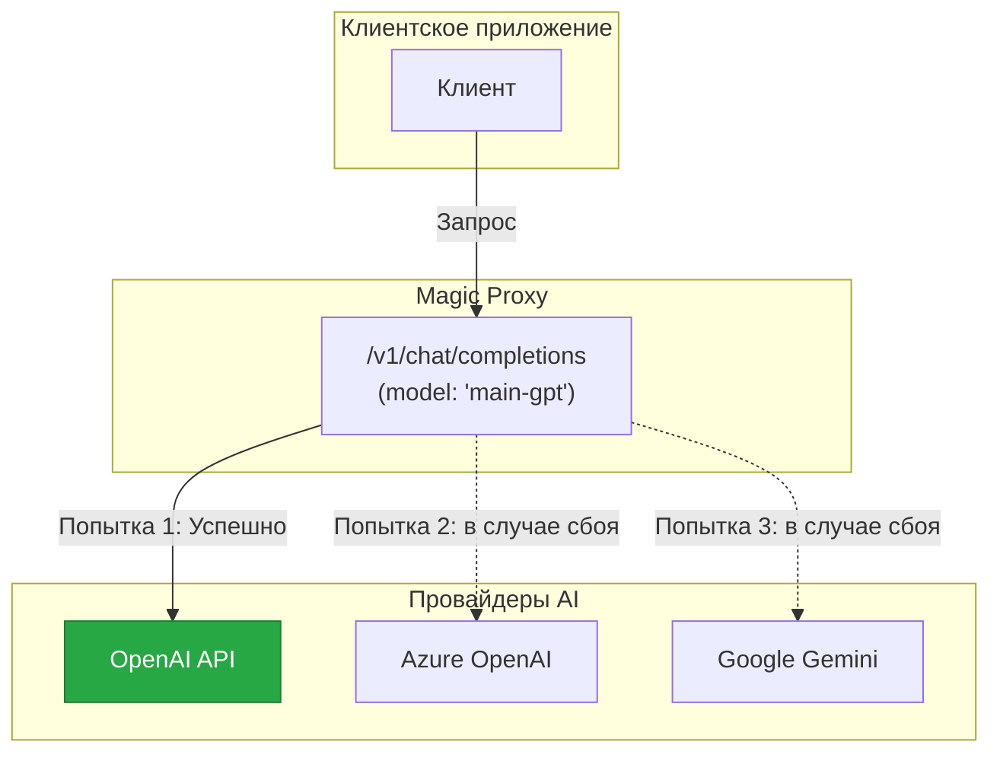
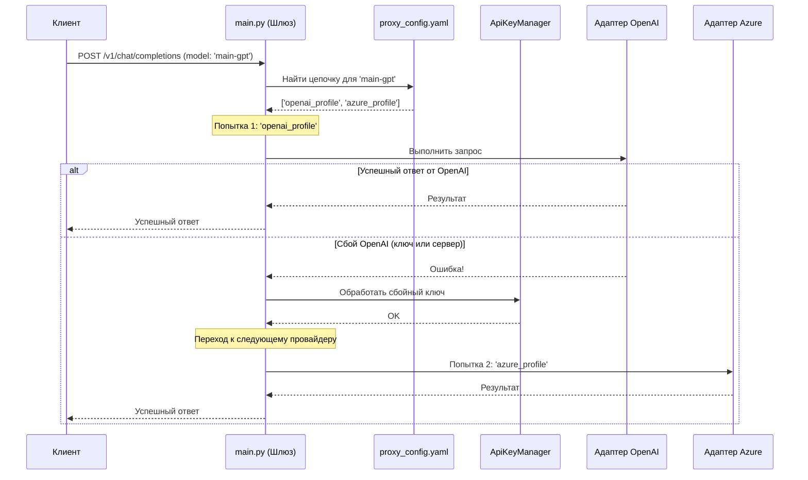
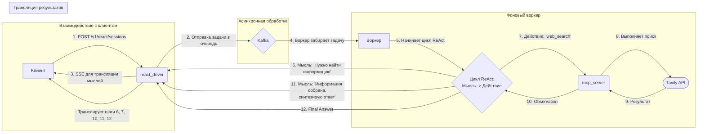

  
  <h1>Magic Proxy</h1>
  

    
    
    
  

> **Пожалуйста, обратите внимание:** Этот репозиторий содержит официальную документацию проекта Magic Proxy. Исходный код является проприетарным и здесь не представлен. Это пространство служит исчерпывающим руководством по его функциям, архитектуре и возможностям для потенциальных партнеров, инвесторов и клиентов.

**Magic Proxy** — это не просто прокси-сервер для LLM, а интеллектуальный шлюз, созданный для **"когнитивного обогащения"** запросов. Он превращает стандартные вызовы моделей в глубоко проработанные, структурированные сессии рассуждений, позволяя даже базовым моделям решать сложные задачи, а продвинутым — делать это более надежно и предсказуемо.

## Оглавление
- [Ключевые возможности](#ключевые-возможности)
- [Сценарии использования](#сценарии-использования)
- [Конкурентное преимущество](#конкурентное-преимущество)
- [Технологический стек](#технологический-стек)
- [Архитектура](#архитектура)
- [Как это работает (визуально)](#как-это-работает-визуально)
- [Навигация по документации](#навигация-по-документации)
- [Видение проекта и дорожная карта](#видение-проекта-и-дорожная-карта)
- [Сотрудничество и возможности](#сотрудничество-и-возможности)
- [Песочница разработчика: визуальный тур по рабочему процессу](#песочница-разработчика-визуальный-тур-по-рабочему-процессу)

## Ключевые возможности

*   **Движок Когнитивного Обогащения**: Реализует продвинутые ReAct-паттерны, позволяя моделям итеративно "думать", вызывать внешние инструменты и формировать ответ на основе наблюдений.
*   **Высокодоступная Маршрутизация**: Автоматически переключается между различными провайдерами и API-ключами при сбоях, обеспечивая максимальную отказоустойчивость.
*   **Универсальный Сервер Инструментов (MCP Server)**: Безопасный и изолированный микросервис для подключения любых "рук" — внешних API, внутренних функций или даже других AI-агентов.
*   **Интерактивная UI-песочница**: Веб-интерфейс для тестирования, сравнения моделей, наблюдения за процессом рассуждения и управления конфигурацией "на лету".
*   **Декларативная Конфигурация**: Единый файл `proxy_config.yaml` для управления всеми аспектами работы шлюза — от маршрутизации до активации когнитивных архитектур.
*   **Платформа для R&D**: Легко создавайте, тестируйте и сравнивайте новые когнитивные паттерны или инструменты, просто добавив файл в нужную директорию.

## Сценарии использования

Magic Proxy — это универсальная платформа, которую можно использовать уже сегодня в различных сценариях:

*   **Высокодоступный шлюз для LLM**: Для нишевых приложений, которым требуется надежный шлюз, работающий по аналогии с `litellm`. Он управляет подключениями к нескольким провайдерам LLM, обрабатывает ротацию API-ключей и отслеживает состояние каждого эндпоинта для обеспечения бесперебойной работы.
*   **Интеллектуальная маршрутизация и управление затратами**: В качестве центрального маршрутизатора для направления запросов к различным моделям в зависимости от их сложности, стоимости или требуемых возможностей, что позволяет оптимизировать как производительность, так и расходы.
*   **Основа для сложных AI-агентов**: Служит надежным бэкендом для разработки сложных AI-агентов, которым необходимо использовать инструменты, применять структурированные рассуждения и взаимодействовать с внешними API — все это управляется через безопасную и масштабируемую микросервисную архитектуру.

## Конкурентное преимущество

Хотя существуют инструменты, предлагающие отдельные компоненты функциональности Magic Proxy, его ключевое преимущество заключается в интегрированном подходе "все-в-одном".

*   **Комбайн "Все-в-одном"**: Magic Proxy — первый в своем роде проект, объединяющий три критически важные функции в единую, целостную систему: высокодоступный прокси, движок когнитивного обогащения (ReAct) и универсальный сервер инструментов. Другие решения могут предлагать одну из этих функций, но не их бесшовную комбинацию.
*   **Фокус на R&D и расширяемости**: Платформа с самого начала создавалась как R&D-песочница. Возможность определять новые, сложные паттерны рассуждений простым добавлением Python-файла обеспечивает быстрое прототипирование и кастомизацию поведения агентов — функция, которой нет в стандартных прокси-инструментах.
*   **Архитектура, готовая к Production**: Основанный на микросервисах, асинхронной обработке через Kafka и полном стеке наблюдаемости, Magic Proxy спроектирован для надежности и масштабируемости, выходя за рамки простых скриптов и представляя собой надежное решение корпоративного уровня.

## Технологический стек

Проект построен на современном, надежном и масштабируемом технологическом стеке:

*   **Основной фреймворк**: Python, FastAPI, Uvicorn
*   **Контейнеризация и оркестрация**: Docker, Docker-Compose
*   **Асинхронная обработка и кэширование**: Apache Kafka, Redis
*   **Наблюдаемость и мониторинг**: OpenTelemetry, Grafana, Loki, Promtail
*   **Ключевые библиотеки**: Pydantic (для валидации данных), HTTPX (как асинхронный HTTP-клиент)

## Архитектура

Проект состоит из нескольких ключевых компонентов, работающих в тандеме:

1.  **Основной шлюз (`main.py`)**: Точка входа на базе FastAPI. Отвечает за прием запросов, маршрутизацию, отказоустойчивость и управление жизненным циклом.
2.  **Движок ReAct (`react_driver.py`)**: R&D-ядро когнитивного обогащения. Оркестрирует итеративный процесс рассуждения, взаимодействуя с LLM и сервером инструментов.
3.  **Сервер инструментов (`mcp_server.py`)**: Отдельный FastAPI-сервис, который предоставляет стандартизированный и безопасный доступ к внешним инструментам.
4.  **UI-песочница (`frontend/`)**: Статический веб-интерфейс (HTML, JS, CSS) для интерактивного взаимодействия со шлюзом.

## Как это работает (визуально)

### 1. Высокоуровневое взаимодействие: Прокси как "черный ящик"

### 2. Внутренний поток: Стандартный запрос

### 3. Внутренний поток: Запрос к движку ReAct

## Навигация по документации

Для более глубокого понимания каждого компонента, пожалуйста, ознакомьтесь с подробной технической документацией:

*   **Основные компоненты**:
    *   [**`main.py` - Оркестратор**](./docs/description/ru/core/main.md)
    *   [**`proxy_config.yaml` - Панель управления**](./docs/description/ru/core/proxy_config.md)
    *   [**`react_driver.py` - R&D-ядро**](./docs/description/ru/core/react_driver.md)
    *   [**`key_manager.py` - Менеджер высокой доступности**](./docs/description/ru/core/key_manager.md)
*   **[Frontend (UI-песочница)](./docs/description/ru/frontend/User_Guide.md)**: Руководство пользователя по работе с интерактивной песочницей.
*   **Паттерны рассуждений**:
    *   [**`basic_react` - Стандартный паттерн**](./docs/description/ru/patterns/basic_react.md)
    *   [**`deepseek_react` - Паттерн "Исследователь"**](./docs/description/ru/patterns/deepseek_react.md)
*   **[Доступные инструменты](./docs/description/ru/tools/available_tools.md)**: Реестр всех инструментов, доступных агенту.

## Видение проекта и дорожная карта

### Краткосрочные цели (ближайшие 3-6 месяцев): Становление универсального оркестратора

*   **Интеграция с платформами для генеративного контента**: Разработка глубокой интеграции с ComfyUI, Godot и Blender, превращая Magic Proxy в интеллектуальный адаптер. Цель — позволить пользователям генерировать сложный контент (изображения, видео, 3D-модели, игровые сцены) через простые, абстрактные запросы.
*   **Внедрение гибридных (вложенных) сценариев**: Реализация механики, где один ReAct-агент может вызывать в качестве инструмента другой. Это позволит создавать сложные, многоэтапные креативные проекты (например, генерация концепт-артов -> создание 3D-моделей -> сборка игровой сцены).

### Среднесрочные цели (следующий год)

*   **Организация стартапа**: Привлечение финансирования для формирования команды, ускорения разработки и вывода продукта на рынок.

### Долгосрочное видение

*   **Демократизация творчества и разработки с помощью ИИ**: Я не стремлюсь заменить существующие специализированные инструменты. Моя цель — создать платформу, которая сократит дистанцию между человеческой идеей и ее цифровым воплощением. Я хочу дать возможность любому человеку — художнику, разработчику, мечтателю — создавать всё, о чем он мечтал, используя ИИ как естественного и мощного партнера. Magic Proxy станет тем самым "волшебным" инструментом, который будет творить эту магию, переводя человеческое воображение на язык машин.

## Сотрудничество и возможности

Я активно ищу партнеров, инвесторов и коллабораторов, разделяющих моё видение. Если вы заинтересованы в использовании Magic Proxy, инвестировании в его будущее или изучении возможностей для партнерства, пожалуйста, свяжитесь со мной.

**Контактная информация:** etot.mir.realen@gmail.com/telegram: @Lotargo

## Песочница разработчика: визуальный тур по рабочему процессу

MagicProxy — это в первую очередь прокси-сервер для интеграции. Чтобы облегчить разработку и отладку, я встроил интегрированную песочницу (Developer Sandbox). Следующий визуальный тур демонстрирует, как использовать ее для конфигурации агентов, управления промптами и наблюдения за процессом мышления LLM в реальном времени.

---

**1. Playground — Ваша Лаборатория для Тестов**

*Главный экран, где вы настраиваете и запускаете тестовые сессии, наблюдая за результатом в реальном времени.*

  

---

**2. Редактор Промптов и Манифестов**

*Встроенный редактор с `diff`-вьювером для полного контроля над промптами и манифестами.*

  

---

**3. Конфигурация Моделей — Движок Песочницы**

*Управление агентами и их "стилями мышления" через `reasoning_mode` в `proxy_config.yaml`.*

  

---

**4. Контроль Конфигураций**

*Любые изменения отслеживаются и отображаются в виде наглядного `diff`, что позволяет избежать ошибок.*

  

---

**5. Запуск Тестовой Сессии**

*Динамическая настройка ReAct-сессии прямо в Playground для быстрого переключения между тестовыми конфигурациями.*

  

---

**6. Анализ Результатов: От Мысли к Ответу**

*Конечная цель — глубокий анализ и отладка. Наблюдайте за внутренним монологом агента (`Thought`) и оценивайте качество финального ответа.*

  
   
  <em>Наблюдение за внутренним монологом агента для отладки его логики.</em>

 

  
   
  <em>Оценка качества и структуры финального ответа, сгенерированного агентом.</em>

